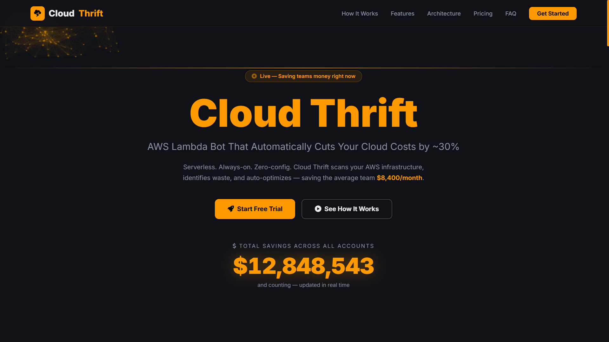
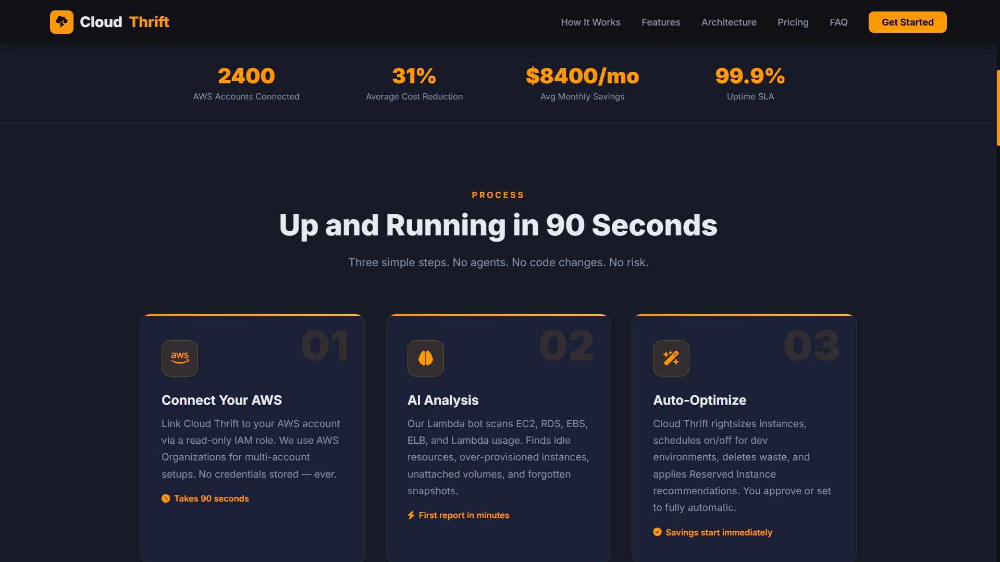
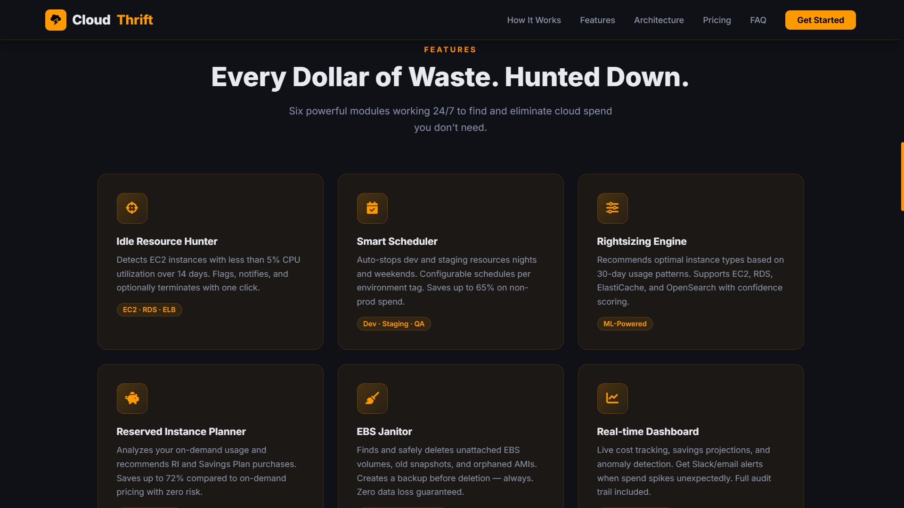
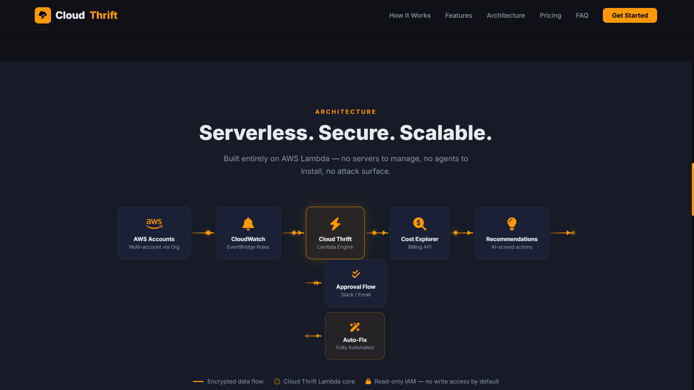
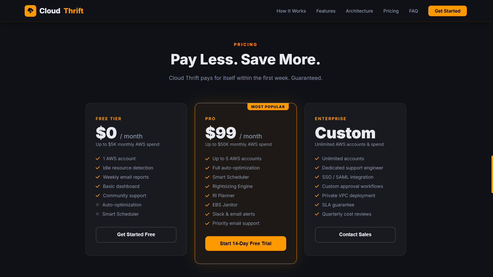
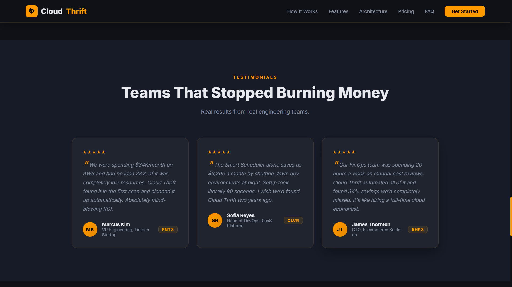
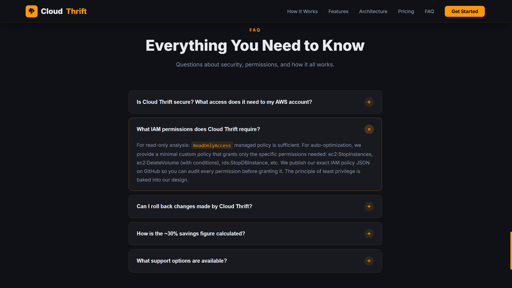
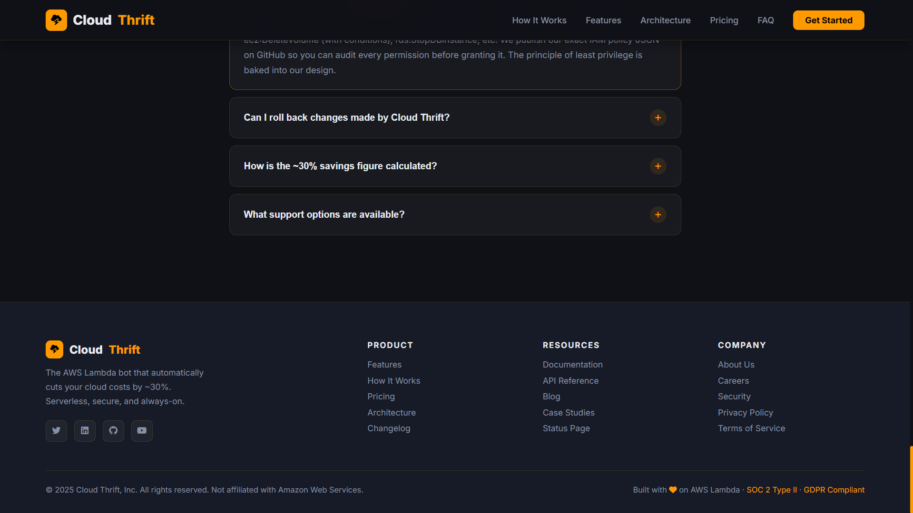

<!-- ========================================= -->
<!-- HERO SECTION -->
<!-- ========================================= -->

<p align="center">
  
</p>

<h1 align="center">⚡ Cloud Thrift</h1>

<p align="center">
  
</p>

<p align="center">
Reduce Cloud Waste • Automate Resource Audits • Optimize AWS Spending
</p>

---

## 🚀 Project Overview

Cloud Thrift is a next-generation AWS Cost Optimization Platform designed to automatically detect cloud waste, identify underutilized resources, and generate intelligent cost-saving recommendations.

Built with AWS Lambda, Boto3, EventBridge, CloudWatch, Cost Explorer, and SNS, the platform continuously monitors cloud infrastructure while requiring zero server management.

Organizations can automate cloud governance and significantly reduce unnecessary spending through intelligent resource auditing.

---

## 🎯 Key Features

<table>
<tr>
<td width="50%">

### 🖥️ EC2 Idle Detector

Detects low-utilization EC2 instances using CloudWatch metrics.

</td>

<td width="50%">

### 💾 EBS Janitor

Finds unattached volumes and old snapshots consuming storage costs.

</td>
</tr>

<tr>
<td>

### 📊 Cost Analytics

Integrates AWS Cost Explorer APIs for spending insights.

</td>

<td>

### ⏰ Smart Scheduler

Automatically starts and stops development environments.

</td>
</tr>

<tr>
<td>

### 🔔 Notifications

Email and Slack alerts through SNS.

</td>

<td>

### 🔒 Secure Execution

IAM-based least privilege access model.

</td>
</tr>
</table>

---

# 🏗️ 3D Architecture

```text
                     ☁️ AWS ACCOUNT

                            │
                            ▼

              ┌─────────────────────────┐
              │  EventBridge Scheduler  │
              └──────────┬──────────────┘
                         │
                         ▼

              ┌─────────────────────────┐
              │     AWS Lambda Bot      │
              └──────────┬──────────────┘
                         │

      ┌──────────────────┼──────────────────┐
      │                  │                  │

      ▼                  ▼                  ▼

┌───────────┐    ┌─────────────┐    ┌─────────────┐
│ EC2 Audit │    │ EBS Audit   │    │ Cost Report │
└───────────┘    └─────────────┘    └─────────────┘

      │                  │                  │

      └──────────────────┼──────────────────┘
                         │

                         ▼

                ┌──────────────┐
                │ SNS Alerts   │
                └──────┬───────┘
                       │

          ┌────────────┴────────────┐
          ▼                         ▼

      📧 Email Alerts          💬 Slack Alerts
```

---

# 📈 Business Impact

| Metric | Improvement |
|----------|----------|
| Monthly Cost Savings | ~30% |
| Dev Environment Savings | Up To 65% |
| EC2 Waste Reduction | Up To 100% |
| Automation Level | Fully Automated |
| Infrastructure Management | Zero Servers |
| Scalability | Automatic |

---

# 🖼️ Product Screenshots

## 🌟 Landing Page



---

## ⚙️ How It Works



---

## 🚀 Features



---

## 🏗️ Architecture



---

## 💰 Pricing



---

## 💬 Testimonials



---

## ❓ FAQ



---

## 📌 Footer



---

# ⚡ Core Modules

## 🖥️ EC2 Idle Detector

Analyzes CPU utilization over time and identifies underutilized instances.

### Benefits

- Eliminate idle infrastructure
- Reduce monthly compute expenses
- Improve cloud governance

---

## 💾 EBS Janitor

Scans storage resources for unattached volumes and outdated snapshots.

### Benefits

- Remove storage waste
- Lower EBS costs
- Maintain clean infrastructure

---

## 📊 Cost Reporter

Provides detailed AWS spending insights.

### Benefits

- Visibility into cloud expenses
- Resource-level breakdowns
- Cost trend analysis

---

## ⏰ Smart Scheduler

Schedules development resources automatically.

### Benefits

- Prevent overnight waste
- Reduce non-production spending
- Fully automated operation

---

# 📂 Project Structure

```text
cloud-thrift/

├── assets/
│   └── screenshots/
│
├── lambda/
│   ├── handler.py
│   └── eventbridge_rule.json
│
├── src/
│   ├── detectors/
│   │   ├── ec2_idle_detector.py
│   │   ├── ebs_janitor.py
│   │   └── cost_reporter.py
│   │
│   └── scheduler/
│       └── smart_scheduler.py
│
├── requirements.txt
├── README.md
└── index.html
```

---

# 🔒 Security

✅ IAM Role-Based Access

✅ Read-Only Audit Mode

✅ CloudWatch Logging

✅ Least Privilege Policies

✅ Automated Backup Before Deletion

✅ Secure Lambda Execution

---

# 🛠️ Tech Stack

### Cloud Services

- AWS Lambda
- AWS EC2
- AWS EBS
- AWS SNS
- AWS EventBridge
- AWS CloudWatch
- AWS Cost Explorer

### Backend

- Python 3.11
- Boto3 SDK

### Monitoring

- CloudWatch Metrics
- CloudWatch Logs

### Security

- IAM Roles
- Least Privilege Policies

---

# 🎓 Learning Outcomes

- AWS Lambda Deployment
- Serverless Architecture
- Cloud Cost Optimization
- Infrastructure Automation
- Event-Driven Systems
- IAM Security
- AWS Monitoring
- Boto3 Development
- Cloud Governance

---

# 🔮 Future Roadmap

- 🤖 AI Cost Prediction
- ☸️ Kubernetes Cost Optimization
- 🌍 Multi-Cloud Support
- 📈 FinOps Dashboard
- 🔔 Real-Time Alerts
- 📊 Advanced Analytics
- ⚡ Terraform Integration

---

# 👨‍💻 Developer

## Kaveesh Dhiman

💻 Full Stack Developer

🏢 Ex-Intern @ National Informatics Centre (NIC)

🎓 B.Tech Computer Science Engineering

📧 kaveesh9876@gmail.com

🔗 GitHub: https://github.com/kaveesh9876-png

🔗 LinkedIn: https://www.linkedin.com/in/kaveesh-dhiman-4b619b322

---

<p align="center">

⭐ If you found this project useful, consider giving it a star.

</p>

<p align="center">
  
</p>
